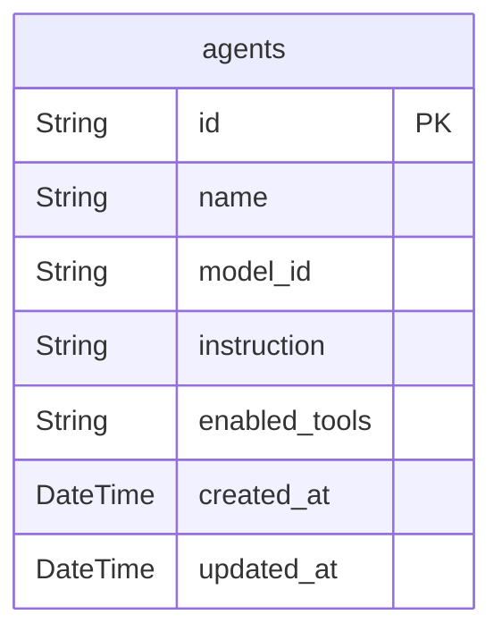
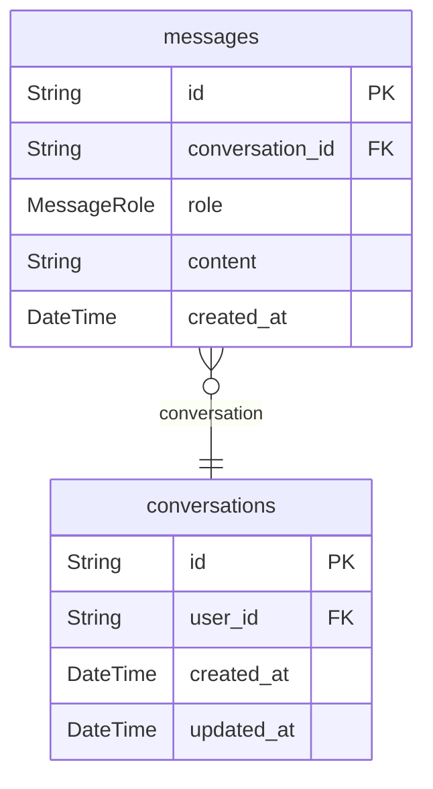
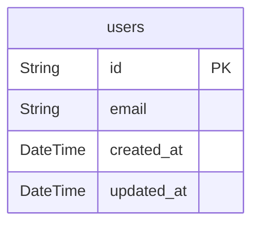
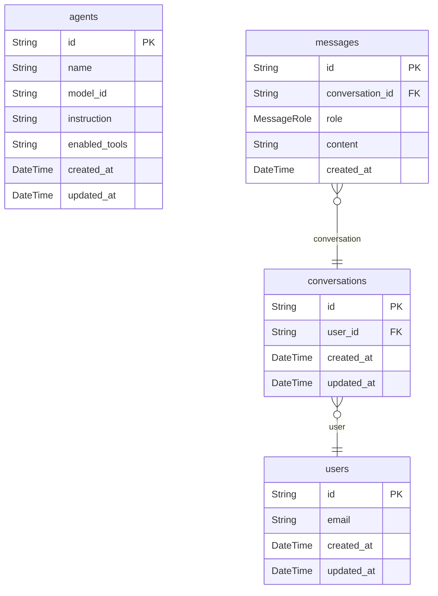

# Database Schema

> Generated by [`prisma-markdown`](https://github.com/samchon/prisma-markdown)

- [Agent](#agent)
- [Chat](#chat)
- [User](#user)
- [Overview](#overview)

## Agent

### `agents`

AIエージェント設定

Properties as follows:

- `id`:
- `name`:
- `model_id`:
- `instruction`:
- `enabled_tools`:
- `created_at`:
- `updated_at`:

## Chat

### `conversations`

チャット会話セッション

Properties as follows:

- `id`:
- `user_id`:
- `created_at`:
- `updated_at`:

### `messages`

チャットメッセージ

Properties as follows:

- `id`:
- `conversation_id`:
- `role`:
- `content`:
- `created_at`:

## User

### `users`

ユーザー

Properties as follows:

- `id`:
- `email`:
- `created_at`:
- `updated_at`:

## Overview

### `agents`

AIエージェント設定

Properties as follows:

- `id`:
- `name`:
- `model_id`:
- `instruction`:
- `enabled_tools`:
- `created_at`:
- `updated_at`:

### `conversations`

チャット会話セッション

Properties as follows:

- `id`:
- `user_id`:
- `created_at`:
- `updated_at`:

### `messages`

チャットメッセージ

Properties as follows:

- `id`:
- `conversation_id`:
- `role`:
- `content`:
- `created_at`:

### `users`

ユーザー

Properties as follows:

- `id`:
- `email`:
- `created_at`:
- `updated_at`:
